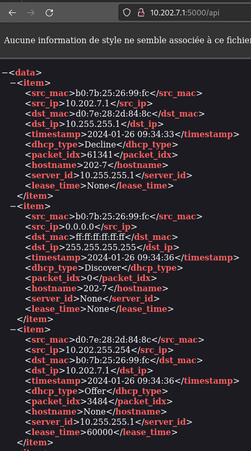
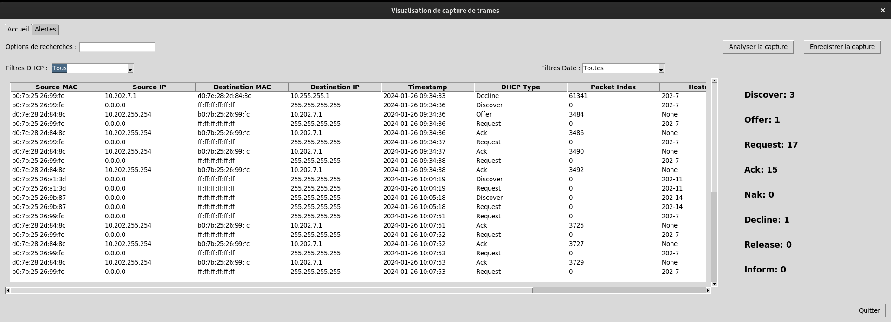

# Guide d'installation et de déploiement de l'application

## 1. Prérequis

Avant de pouvoir déployer l'application il faut dans un premier temps télécharger les paquets nécessaires notamment docker et docker-compose.

### Installation de Docker

Pour l'installation de docker il faudra aller sur un terminal puis taper les commandes suivantes :

    sudo apt update

    sudo apt upgrade -y

    sudo apt install -y apt-transport-https ca-certificates curl software-properties-common

    curl -fsSL https://download.docker.com/linux/ubuntu/gpg | sudo gpg --dearmor -o /usr/share/keyrings/docker-archive-keyring.gpg

    echo "deb [arch=amd64 signed-by=/usr/share/keyrings/docker-archive-keyring.gpg] https://download.docker.com/linux/ubuntu $(lsb_release -cs) stable" | sudo tee /etc/apt/sources.list.d/docker.list > /dev/null

    sudo apt update

    sudo apt install -y docker-ce docker-ce-cli containerd.io

    sudo usermod -aG docker $USER

Vérification que docker est bien installé :

```bash
abdekhnohs@Abdekhanohs:~/Bureau# docker --version
Docker version 25.0.0, build e758fe5
```

Vérification que le service tourne bien sans conflit avec `systemctl status docker` ou `service docker status` :

```bash
abdekhnohs@Abdekhanohs:~/Bureau# systemctl status docker
```

```bash
● docker.service - Docker Application Container Engine
     Loaded: loaded (/lib/systemd/system/docker.service; enabled; vendor preset: enabled)
     Active: active (running) since Thu 2024-01-25 14:21:55 CET; 5h 31min ago
TriggeredBy: ● docker.socket
       Docs: https://docs.docker.com
   Main PID: 928 (dockerd)
      Tasks: 13
     Memory: 126.7M
        CPU: 3.800s
     CGroup: /system.slice/docker.service
             └─928 /usr/bin/dockerd -H fd:// --containerd=/run/containerd/containerd.sock

janv. 25 14:21:53 Abdekhanohs dockerd[928]: time="2024-01-25T14:21:53.158914919+01:00" level=info msg="Starting up"
janv. 25 14:21:53 Abdekhanohs dockerd[928]: time="2024-01-25T14:21:53.166091096+01:00" level=info msg="detected 127.0.0.53 nameserver, assuming systemd-resolved, so using resolv.con>
janv. 25 14:21:53 Abdekhanohs dockerd[928]: time="2024-01-25T14:21:53.408062258+01:00" level=info msg="[graphdriver] using prior storage driver: overlay2"
janv. 25 14:21:53 Abdekhanohs dockerd[928]: time="2024-01-25T14:21:53.909404732+01:00" level=info msg="Loading containers: start."
janv. 25 14:21:54 Abdekhanohs dockerd[928]: time="2024-01-25T14:21:54.524013115+01:00" level=info msg="Default bridge (docker0) is assigned with an IP address 172.17.0.0/16. Daemon >
janv. 25 14:21:54 Abdekhanohs dockerd[928]: time="2024-01-25T14:21:54.608679164+01:00" level=info msg="Loading containers: done."
janv. 25 14:21:54 Abdekhanohs dockerd[928]: time="2024-01-25T14:21:54.668284957+01:00" level=info msg="Docker daemon" commit=615dfdf containerd-snapshotter=false storage-driver=over>
janv. 25 14:21:54 Abdekhanohs dockerd[928]: time="2024-01-25T14:21:54.669573353+01:00" level=info msg="Daemon has completed initialization"
janv. 25 14:21:55 Abdekhanohs dockerd[928]: time="2024-01-25T14:21:55.114878779+01:00" level=info msg="API listen on /run/docker.sock"
janv. 25 14:21:55 Abdekhanohs systemd[1]: Started Docker Application Container Engine.
```

### Installation de docker-compose

De même pour l'installation de docker-compose il faudra taper les commandes suivantes sur un terminal :

    sudo curl -L "https://github.com/docker/compose/releases/latest/download/docker-compose-$(uname -s)-$(uname -m)" -o /usr/local/bin/docker-compose

    sudo chmod +x /usr/local/bin/docker-compose

Vérification que docker-compose est bien installé :

```bash
abdekhnohs@Abdekhanohs:~/Bureau# docker-compose --version
Docker Compose version v2.24.1
```

### Téléchargements des fichiers requis

Pour le téléchargements des fichiers Dockerfiles et programmes Python il faudra cloner le projet qui est dans un repos git en utilisant `git clone`. 

Pour utiliser `git clone` il faut installer le paquet `git` au préalable, s'il n'est pas présent sur votre système, il faut l'installer avec la commande suivante :

    sudo apt-get install git

Ensuite, je clone le repos git comme ci-dessous :

```bash
abdekhnohs@Abdekhanohs:~/Bureau# git clone https://github.com/Abdessabourbaali/SAE501-502-BVB.git
Clonage dans 'SAE501-502-BVB'...
remote: Enumerating objects: 11, done.
remote: Counting objects: 100% (11/11), done.
remote: Compressing objects: 100% (11/11), done.
remote: Total 11 (delta 1), reused 0 (delta 0), pack-reused 0
Réception d'objets: 100% (11/11), 11.32 Kio | 610.00 Kio/s, fait.
Résolution des deltas: 100% (1/1), fait.
```

Vérification que le repos est bien cloner sur le PC avec `ls` :

```bash
abdekhnohs@Abdekhanohs:~/Bureau# ls
 poubelle   SAE501-502-BVB  'Scripts Qos-20231001'   vm-key
```

On peut voir que le repos est bien présent dans le répertoire où j'ai lancé la commande (dans mon cas /home/test/Bureau).

## 2. Configuration des fichiers pour le déploiement

Une fois que le repos git est cloné, il faudra entrer dans le dossier SAE501-502-BVB avec `cd` :

```bash
abdekhnohs@Abdekhanohs:~/Bureau# cd SAE501-502-BVB/
abdekhnohs@Abdekhanohs:~/Bureau/SAE501-502-BVB# 
abdekhnohs@Abdekhanohs:~/Bureau/SAE501-502-BVB# ls
docker-compose.yml  Dockerfiles  Programs  requirements.txt
```

Après être rentré dans le dossier, l'application ne pourra pas se lancer directement. Il faudra configurer quelques fichiers selon vos besoins pour que le déploiement soit fonctionnel.

### Configuration du fichier docker-compose.yml

Tout d'abord, il faut configurer le chemin du dossier qui a été téléchargé avec le git clone pour que le build du conteneur `dockerfile-api` soir fonctionnel, pour ma part j'ai téléchargé le dossier sur /home/test/Bureau donc je spécifie cela dans `context` comme ci-dessous :

```yaml
dockerfile-api:
    build:
      context: /home/test/Bureau/SAE501-502-BVB
      dockerfile: Dockerfiles/Dockerfile-api
```

Je fais ensuite de même pour le conteneur `dockerfile-tkinter` :

```yaml
dockerfile-tkinter:
    build:
      context: /home/test/Bureau/SAE501-502-BVB
      dockerfile: Dockerfiles/Dockerfile-tkinter
```

#### REMARQUES

Les chemins complets (`context` et `dockerfile`) dans le fichier docker-compose doivent être adaptés à la structure de répertoires et à la localisation réelle des fichiers Dockerfile.

### Configuration du fichier interface.py

Ensuite, il faut modifier dans le programme `interface.py` au niveau des lignes 184 et 280 l'URL de l'API car l'interface graphique est directement connecté à l'API pour la récupération des données.

L'adresse IP à spécifier sur l'URL est celui du docker qui fait tourner l'API qui à la même adresse IP que votre machine hôte. Si jamais vous ne la connaissez pas, tapez la commande `ip a` sur votre terminal de commande.

```python
# Récupération API 
        api_url = "http://10.202.7.1:5000/api"
        response = requests.get(api_url)
```

### 3. Lancement de l'application

Avant de lancer l'application, il faut taper la commande suivante sur votre terminal, l'adresse IP à entrer est toujours celle de votre PC hôte.

```bash
abdekhnohs@Abdekhanohs:~/Bureau/SAE501-502-BVB# xhost +local:10.202.7.1
non-network local connections being added to access control list
```

Cette commande permet d'autoriser au conteneur docker distant avec l'adresse IP `10.202.7.1` à afficher des applications graphiques sur l'écran local. Sans cette commande l'interface graphique ne pourrait pas se lancer correctement.

Après avoir tout configurer, il faut tout simplement taper la commande ci-dessous pour construire l'environnement et lancer l'application.

```bash
abdekhnohs@Abdekhanohs:~/Bureau/SAE501-502-BVB# sudo docker-compose up --build
```

```bash
[+] Building 2.7s (24/24) FINISHED                                                                                                                              docker:default
 => [dockerfile-tkinter internal] load build definition from Dockerfile-tkinter                                                                                           0.0s
 => => transferring dockerfile: 711B                                                                                                                                      0.0s
 => [dockerfile-tkinter internal] load .dockerignore                                                                                                                      0.0s
 => => transferring context: 2B                                                                                                                                           0.0s
 => [dockerfile-tkinter internal] load metadata for docker.io/library/python:3.9-slim                                                                                     2.7s
 => [dockerfile-api internal] load .dockerignore                                                                                                                          0.0s
 => => transferring context: 2B                                                                                                                                           0.0s
 => [dockerfile-api internal] load build definition from Dockerfile-api                                                                                                   0.0s
 => => transferring dockerfile: 841B                                                                                                                                      0.0s
 => [dockerfile-api internal] load metadata for docker.io/library/python:3.9                                                                                              2.6s
 => [dockerfile-api internal] load build context                                                                                                                          0.0s
 => => transferring context: 139B                                                                                                                                         0.0s
 => [dockerfile-api 1/7] FROM docker.io/library/python:3.9@sha256:3d9dbe78e1f45ed2eb525b462cdb02247cc0956713325aeeffa37cb5f2c8c42e                                        0.0s
 => CACHED [dockerfile-api 2/7] RUN apt-get update && apt-get install -y libpcap-dev && rm -rf /var/lib/apt/lists/*                                                       0.0s
 => CACHED [dockerfile-api 3/7] COPY Programs/sniffer.py /app/sniffer.py                                                                                                  0.0s
 => CACHED [dockerfile-api 4/7] COPY Programs/api.py /app/api.py                                                                                                          0.0s
 => CACHED [dockerfile-api 5/7] WORKDIR /app                                                                                                                              0.0s
 => CACHED [dockerfile-api 6/7] COPY requirements.txt /app/requirements.txt                                                                                               0.0s
 => CACHED [dockerfile-api 7/7] RUN pip --no-cache-dir install -r requirements.txt                                                                                        0.0s
 => [dockerfile-api] exporting to image                                                                                                                                   0.0s
 => => exporting layers                                                                                                                                                   0.0s
 => => writing image sha256:b51fe0a2348895f3120cb95e9e4f638278d40425b2c755eac8a0991e834075cf                                                                              0.0s
 => => naming to docker.io/library/sae501-502-bvb-dockerfile-api                                                                                                          0.0s
 => [dockerfile-tkinter 1/7] FROM docker.io/library/python:3.9-slim@sha256:4608ec5783d97e57c79be56790e9f55265b7d5abbe9cf1a834dadb8ac3d0e4a0                               0.0s
 => [dockerfile-tkinter internal] load build context                                                                                                                      0.0s
 => => transferring context: 107B                                                                                                                                         0.0s
 => CACHED [dockerfile-tkinter 2/7] RUN apt-get update && apt-get install -y iputils-ping                                                                                 0.0s
 => CACHED [dockerfile-tkinter 3/7] COPY Programs/interface.py /app/interface.py                                                                                          0.0s
 => CACHED [dockerfile-tkinter 4/7] WORKDIR /app                                                                                                                          0.0s
 => CACHED [dockerfile-tkinter 5/7] RUN apt-get update && apt-get install -y python3-tk                                                                                   0.0s
 => CACHED [dockerfile-tkinter 6/7] COPY requirements.txt /app/requirements.txt                                                                                           0.0s
 => CACHED [dockerfile-tkinter 7/7] RUN pip --no-cache-dir install -r requirements.txt                                                                                    0.0s
 => [dockerfile-tkinter] exporting to image                                                                                                                               0.0s
 => => exporting layers                                                                                                                                                   0.0s
 => => writing image sha256:3b07c44b7936bdd7836ffca182d34982580297bb3be713b00f02420af0f3c268                                                                              0.0s
 => => naming to docker.io/library/sae501-502-bvb-dockerfile-tkinter                                                                                                      0.0s
[+] Running 2/0
 ✔ Container sae501-502-bvb-dockerfile-api-1      Created                                                                                                                 0.0s 
 ✔ Container sae501-502-bvb-dockerfile-tkinter-1  Created                                                                                                                 0.0s 
Attaching to dockerfile-api-1, dockerfile-tkinter-1
```

Comme on peut le voir le déploiement s'est terminé sans encombre. On peut vérifier que les conteneurs sont bien lancé avec la commande `docker ps` :

```bash
abdekhnohs@Abdekhanohs:~/Bureau/SAE501-502-BVB# sudo docker ps
```

```bash
CONTAINER ID   IMAGE                               COMMAND                  CREATED          STATUS          PORTS     NAMES
8e9db073a8a1   sae501-502-bvb-dockerfile-api       "sh -c 'python3 snif…"   33 minutes ago   Up 21 seconds             sae501-502-bvb-dockerfile-api-1
00064353f986   sae501-502-bvb-dockerfile-tkinter   "python3 interface.py"   33 minutes ago   Up 21 seconds             sae501-502-bvb-dockerfile-tkinter-1
```

On peut voir que les conteneurs ont bien le status `up` donc ils sont bien fonctionnel.

Après avoir capturer quelque requêtes DHCP votre API devrai ressembler à quelque chose comme cela :



Et l'interface grahique de même puisque elle est connecté à l'API.



Pour arrêter la capture de trame il faut utiliser le raccourci `Ctrl+C` sur le terminal où le lancement de l'application a été effectué.

```bash
^CGracefully stopping... (press Ctrl+C again to force)
[+] Stopping 2/2
 ✔ Container sae501-502-bvb-dockerfile-tkinter-1  Stopped                                                                                                                 1.4s 
 ✔ Container sae501-502-bvb-dockerfile-api-1      Stopped
```

Pour relancer l'environnement il faut utiliser la même commande sans l'option `--build`

```bash
abdekhnohs@Abdekhanohs:~/Bureau/SAE501-502-BVB# sudo docker-compose up
```

Si jamais vous quittez l'interface graphique, il faut taper la commande suivante `docker start "nom du conteneur ou son ID"`

```bash
abdekhnohs@Abdekhanohs:~/Bureau/SAE501-502-BVB# sudo docker start 00064353f986
```

## 3. Liens utiles

- [Troubleshooting / Dépannage](https://github.com/matheobalazuc/SAE501-502-BVB/blob/Capture-de-trame-Etudiant-n%C2%B01/Docs/Troubleshooting.md)


- [Documentation développeur](https://github.com/matheobalazuc/SAE501-502-BVB/blob/Capture-de-trame-Etudiant-n%C2%B01/Docs/Documentation%20d%C3%A9veloppeur.md)